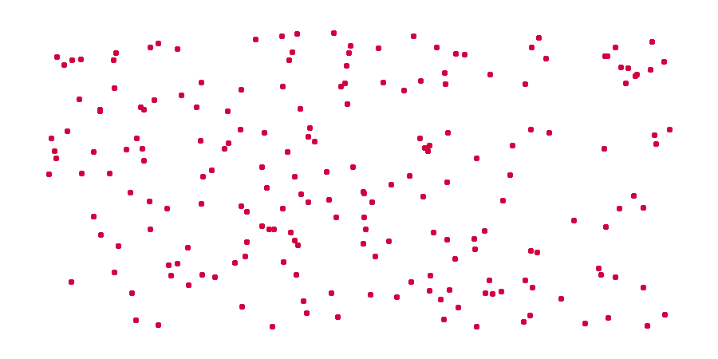

# tsp-grasp

Welcome to `tsp-grasp`! A Python package with Heuristics for solving the Traveling Salesman Problem (TSP).

[Documentation](https://tsp-grasp.readthedocs.io/en/latest/)

<p align="center">
  
</p>

## Install

The package `tspgrasp` is available on PyPI, so you can install it via `pip` by running the following command line:

```
pip install tspgrasp
```

To install the package in development versions, clone it from github using:

```
git clone https://github.com/bruscalia/tsp-grasp.git
```

And run one of the two following commands:

```
pip install .
```

```
python setup.py install
```

Make sure Cython and numpy are also available in your python environment.

Alternatively, you can directly run:

```
pip install git+https://github.com/bruscalia/tsp-grasp.git
```

Here is a minimum working example in which a symmetric distance matrix is produced from 2-dimensional coordinates.

## Use

```python
# Imports
import numpy as np
from scipy.spatial.distance import pdist, squareform
from tspgrasp import Grasp
```

```python
# Create distance matrix
X = np.random.random((100, 2))
D = squareform(pdist(X))

# Instantiate algorithm and solve problem
grasp = Grasp(seed=12)
sol = grasp(D, time_limit=10, max_iter=100)

# Display cost and tour
print(f"Cost: {sol.cost}")
print(f"Tour: {sol.tour}")
```

## Theory

Greedy Randomized Adaptive Search Procedures (GRASP) are metaheuristics constituted by a hybridization of a semi-greedy procedure with a local search method. For more details please refer to Resende & Ribeiro (2016).

Local search moves implemented were based on the work of Vidal (2022).


## Contact

You can reach out to me at bruscalia12@gmail.com

## References

Resende, M. G., & Ribeiro, C. C. (2016). Optimization by GRASP. Springer Science+ Business Media New York. https://doi.org/10.1007/978-1-4939-6530-4

Vidal, T. (2022). Hybrid genetic search for the CVRP: Open-source implementation and SWAP* neighborhood. Computers & Operations Research, 140, 105643. https://doi.org/10.1016/j.cor.2021.105643
