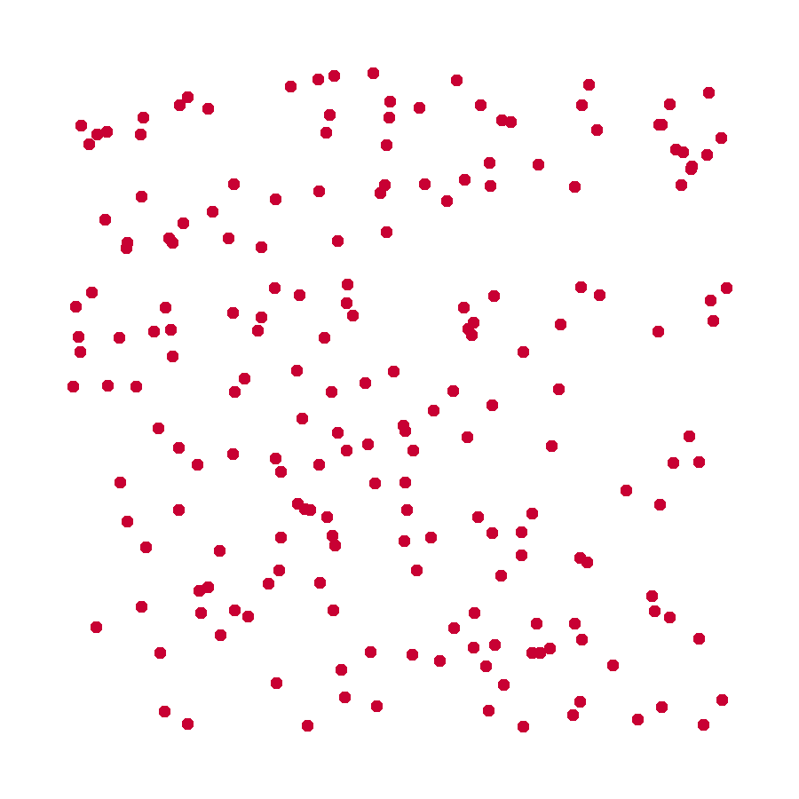

# tsp-grasp

Welcome to `tsp-grasp`! A Python package with Heuristics for solving the Traveling Salesman Problem (TSP).


<p align="center">
  
</p>

## Install

To install the package, clone it from github using `git clone https://github.com/bruscalia/tsp-grasp.git` and run `pip install .` or `python setup.py install` in the repository root folder. Make sure Cython and numpy are also available in your python environment.

Alternatively, you can directly run:

```
pip install git+https://github.com/bruscalia/tsp-grasp.git
```

Here is a minimum working example in which a symmetric distances matrix is produced from 2-dimensional coordinates.

## Use

```python
# Imports
import numpy as np
from scipy.spatial.distance import pdist, squareform
from tspgrasp.grasp import Grasp
```

```python
# Create distances matrix
X = np.random.random((100, 2))
D = squareform(pdist(X))

# Instantiate algorithm and solve problem
grasp = Grasp(seed=12)
sol = grasp(D, time_limit=10, max_iter=100)

# Display cost and tour
print(f"Cost: {sol.cost}")
print(f"Tour: {sol.tour}")
```

## Contact

You can reach out to me at bruscalia12@gmail.com

## References
