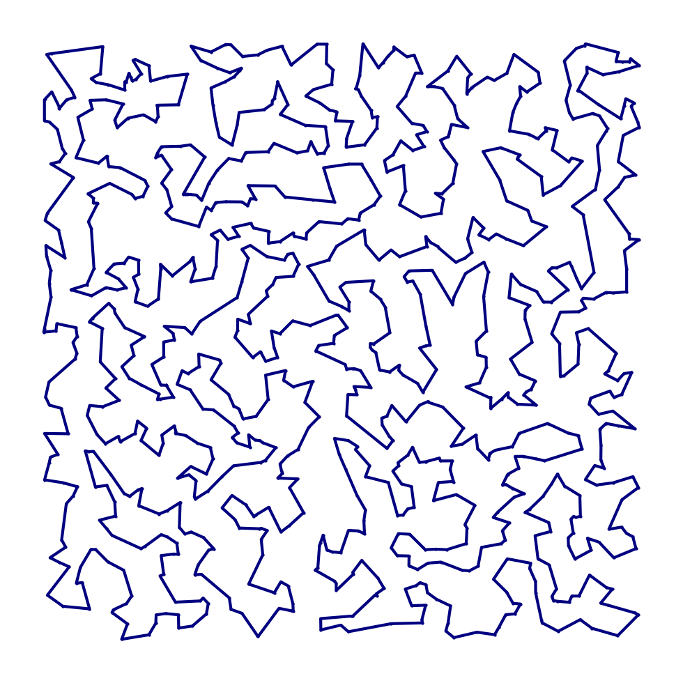

# tsp-grasp

A Greedy Randomized Adaptive Search Procedure (GRASP) algorithm designed for the TSP

<p align="left">
  
</p>

## Use

To install the package, clone it from github and use `pip install`. Make sure Cython and numpy are also available in your python environment.

```
pip install git+https://github.com/bruscalia/tsp-grasp
```

Here is a minimum working example:

```python
# External imports
import numpy as np
from scipy.spatial.distance import pdist, squareform
from tspgrasp.grasp import Grasp
from tspgrasp.problem import Problem
```

```python
np.random.seed(12)

N = 100
X = np.random.random((N, 2))
D = np.round(squareform(pdist(X)), decimals=8)

problem = Problem(N, D)
grasp = Grasp(alpha=1.0, seed=12, time_limit=10)
sol = grasp.solve(problem)

print(sol.cost)
```

## Contact

You can reach out to me at bruscalia12@gmail.com
