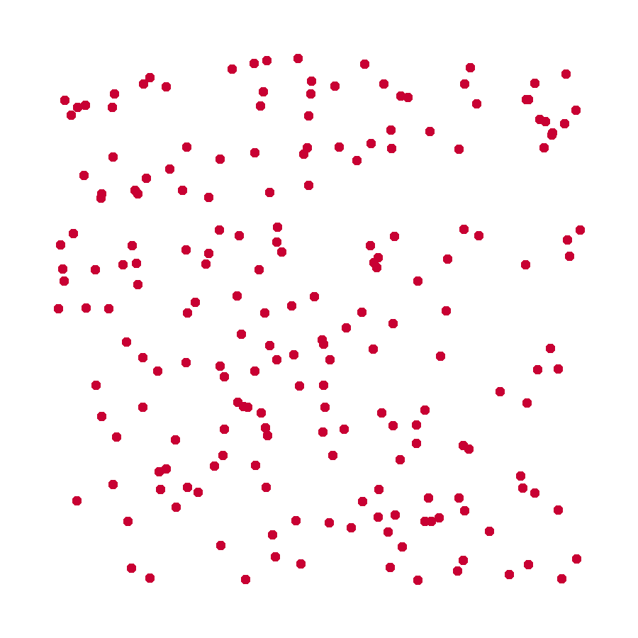

.. tspgrasp documentation master file, created by
   sphinx-quickstart on Thu Nov  2 15:39:57 2023.
   You can adapt this file completely to your liking, but it should at least
   contain the root `toctree` directive.

tspgrasp
========

Welcome to `tspgrasp`! A Python package with Heuristics for solving the Traveling Salesman Problem (TSP).

You can find :doc:`API details <api>` here. And a simple coding example :ref:`below <use>` .

.. _use:

Use
---

.. code-block:: python

   # Imports
   import numpy as np
   from scipy.spatial.distance import pdist, squareform
   from tspgrasp.grasp import Grasp

   # Create distances matrix
   X = np.random.random((100, 2))
   D = squareform(pdist(X))

   # Instantiate algorithm and solve problem
   grasp = Grasp(seed=12)
   sol = grasp(D, time_limit=10, max_iter=100)

   # Display cost and tour
   print(f"Cost: {sol.cost}")
   print(f"Tour: {sol.tour}")

.. toctree::
   :maxdepth: 2
   :caption: API:
   :hidden:

   api

